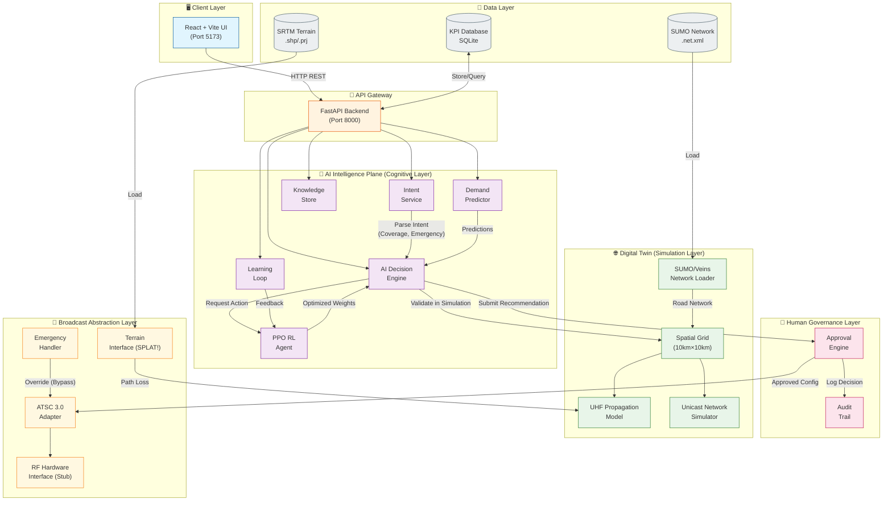
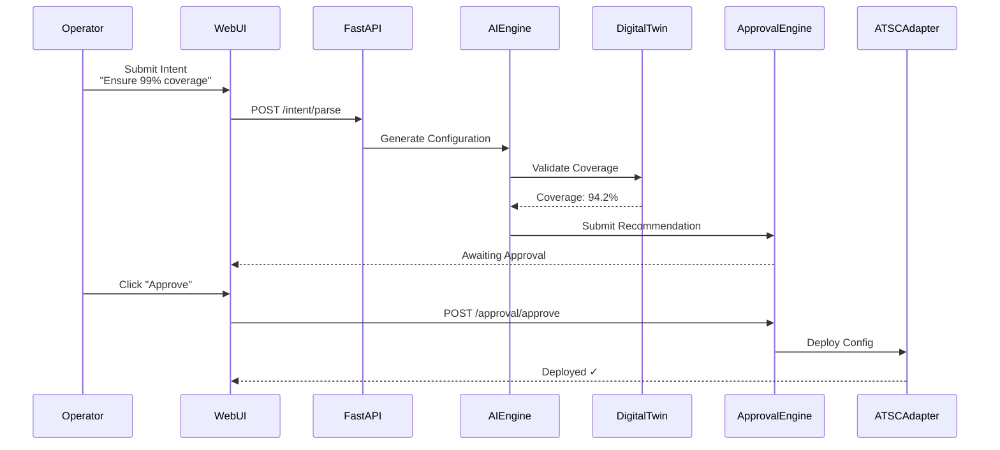

# AI-Native Broadcast Intelligence Platform - System Architecture

## High-Level Architecture Diagram



---

## Component Breakdown

### 🖥️ **Client Layer**

| Component | Technology | Responsibility |
|-----------|------------|----------------|
| Web UI | React 18 + Vite + TailwindCSS | 12 dashboard pages for NOC operators |

**Key Pages:**

- `IntentControl.tsx` - Operator intent injection
- `CognitiveBrain.tsx` - AI reasoning visualization
- `BroadcastTelemetry.tsx` - Live KPI monitoring
- `EmergencyMode.tsx` - Emergency override controls

---

### 🔌 **API Gateway**

| Component | Technology | Responsibility |
|-----------|------------|----------------|
| FastAPI Backend | Python 3.11, FastAPI, Uvicorn | REST API serving 11 route modules |

**Endpoints:**

- `/intent/*` - Intent parsing and policy extraction
- `/ai/*` - AI decision engine and cognitive state
- `/approval/*` - Human approval workflow
- `/kpi/*` - KPI metrics and history
- `/telemetry/*` - Broadcast-grade telemetry
- `/rf/*` - RF adapter status (simulation only)

---

### 🧠 **AI Intelligence Plane**

| Component | Technology | Responsibility |
|-----------|------------|----------------|
| Intent Service | Python | Parse natural language → structured policy |
| AI Engine | Python | Generate ATSC 3.0 configurations |
| PPO RL Agent | stable-baselines3, PyTorch | Learn optimal weight adjustments |
| Demand Predictor | Python | Proactive load forecasting |
| Learning Loop | Python | Track and improve AI decisions over time |
| Knowledge Store | Python | Store historical patterns and outcomes |

**Decision Flow:**

```
Intent → Policy → AI Engine → Digital Twin Validation → Human Approval → Deployment
```

---

### 👤 **Human Governance Layer**

| Component | Technology | Responsibility |
|-----------|------------|----------------|
| Approval Engine | Python | State machine for approve/reject workflow |
| Audit Trail | In-memory + DB | Complete traceability of all decisions |

**States:** `AI_RECOMMENDED` → `AWAITING_APPROVAL` → `ENGINEER_APPROVED` → `DEPLOYED`

---

### 🌐 **Digital Twin (Simulation)**

| Component | Technology | Responsibility |
|-----------|------------|----------------|
| Spatial Grid | NumPy | 10km×10km coverage simulation |
| Channel Model | Python | Log-distance path loss + shadow fading |
| SUMO Loader | XML Parser | Load real road networks (199 junctions, 457 edges) |
| Unicast Model | Python | Cellular congestion simulation |

---

### 📡 **Broadcast Abstraction Layer**

| Component | Technology | Responsibility |
|-----------|------------|----------------|
| ATSC Adapter | Python | Map AI decisions to A/322 parameters |
| RF Interface | Stub | Placeholder for future hardware integration |
| Terrain Interface | Stub | SPLAT! coverage map integration |
| Emergency Handler | Python | CAP alerts and automatic override |

> ⚠️ **NOTE:** This system does NOT transmit RF signals. All operations are simulated.

---

### 💾 **Data Layer**

| Component | Format | Content |
|-----------|--------|---------|
| KPI Database | SQLite | Historical KPIs, learning outcomes |
| SUMO Network | `.net.xml` | Erlangen road network (Veins) |
| SRTM Terrain | `.shp/.prj` | Elevation data for propagation |

---

## Data Flow Sequence



---

## Technology Stack Summary

| Layer | Technologies |
|-------|--------------|
| **Frontend** | React 18, TypeScript, Vite, TailwindCSS, Recharts |
| **Backend** | Python 3.11, FastAPI, Uvicorn, Pydantic |
| **AI/ML** | PyTorch, stable-baselines3, Gymnasium, NumPy, SciPy |
| **Simulation** | Custom Digital Twin, SUMO/Veins integration |
| **Data** | SQLite, XML parsing, Shapefiles |
| **DevOps** | Git, pytest |

---

## Key Architectural Principles

1. **Simulation-First Validation** - All AI decisions are tested in the Digital Twin before approval
2. **Human-in-the-Loop** - No configuration deploys without explicit human approval
3. **Separation of Concerns** - AI intelligence is decoupled from RF transmission
4. **Explainability** - Every AI decision includes reasoning and confidence scores
5. **Emergency Override** - Deterministic emergency paths bypass normal approval when lives are at risk

---

## ITU FG-AINN Architecture Alignment

This system conforms to the **ITU Focus Group on AI for Future Networks (FG-AINN)** architecture framework:

| ITU Framework | Our Implementation | Diagram |
|---------------|-------------------|---------|
| **Layered AI-Native Network** | 3-Layer Broadcast Control Plane | [AINN_Layered_Architecture.puml](./AINN_Layered_Architecture.puml) |
| **Agentic AI Framework** | Cognitive Broadcasting System | [AINN_Agentic_Framework.puml](./AINN_Agentic_Framework.puml) |
| **Model LCM Framework** | RL Model Lifecycle Management | [AINN_Model_LCM.puml](./AINN_Model_LCM.puml) |

### Layer Mapping

```
┌─────────────────────────────────────────────────────────────┐
│ Management & Orchestration Layer                            │
│   [ai_engine.py] [optimizer.py] [visualization_router.py]   │
├─────────────────────────────────────────────────────────────┤
│ Network Function Layer                                       │
│   [rl_agent.py] [learning_loop.py] [spatial_model.py]       │
│   [broadcast_telemetry.py] [approval_engine.py]             │
├─────────────────────────────────────────────────────────────┤
│ Infrastructure Layer                                         │
│   [rf_adapter.py] [baseband_interface.py] [FCC/Cell Data]   │
└─────────────────────────────────────────────────────────────┘
```

For detailed component mapping, see [AINN_Architecture_Mapping.md](./AINN_Architecture_Mapping.md).

### References

- ITU-T FG-AINN-I-116-R2: AI-Native Network Architecture
- ITU-T FG-AINN-I-139: Agentic AI Framework and Model LCM
- [Comparison Baselines](./Comparison_Baselines.md): System evaluation against static ATSC and unicast alternatives
